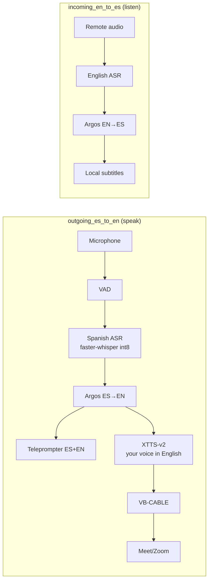

<div align="center">

# ES ↔ EN voice translator for job interviews

**Everything runs on your own computer. Audio never leaves your machine.**

[English](README.md) · [Español](README.es.md)

[](https://github.com/KevinGracianoL/traductor-voz-entrevistas/actions)


**By [Kevin Graciano](https://github.com/KevinGracianoL)** — clone the repository and run it on your machine (see Installation and usage).

</div>

---

## What it is

This program helps you during a job interview in English. It listens to the interviewer through the call audio and shows the Spanish translation on screen. When you answer in Spanish into your microphone, it transcribes your answer, translates it into English and speaks it with a voice cloned from yours, feeding it into the call through a virtual microphone. Everything runs on your own computer: no audio or text is sent to cloud services.

The point is that you can check, as text, what you understood and what you are about to say before saying it, without depending on an internet connection or an external API.

---

## Demo video

[`docs/demo/demo_portafolio.mp4`](docs/demo/demo_portafolio.mp4) (1 min 4 s) — a real recording on the reference machine, with system audio:

- The interviewer speaks English and the screen shows the text with its Spanish translation.
- When you finish answering in Spanish into the microphone, the text of your answer appears.
- Your English voice comes out through the virtual microphone into the call.

**A limitation you can see in the video:** between the end of your answer and the moment your English voice is heard there is a wait of about 14 seconds in that recording. Of that time, 2.5 s are the confirmation that you stopped talking, and the rest is translation and voice generation (4.2 to 11.5 s measured in the run, depending on the sentence). The translated voice is not immediate.

---

## What it can do and what its limits are

**Verified capabilities**

- Transcribe the interviewer's English and show Spanish subtitles on `localhost`.
- Transcribe your Spanish voice and show the text on screen.
- Generate your answer in English with a voice cloned from samples of yours, and route it to the call's virtual microphone.
- Work with Meet, Zoom or Teams through virtual audio devices, with no plugins or platform integration.
- Keep running when a stage fails: if the cloned voice is unavailable it falls back to a generic voice, and as a last resort to subtitles only. The flow does not stop.

**Current limits**

- The English voice is not immediate: closing the turn (the moment it starts playing) took 4.2 to 11.5 seconds in the demo recording, and about 2 seconds for the first audio with the GPU idle.
- If the interviewer talks while the system is generating your voice, generation slows down (see Technical results) and the end of the audio may come out with pauses. In the demo recording this does not happen because nobody talks over it.
- It requires Windows, a compatible NVIDIA GPU (the reference is a 4 GB GTX 1650 Ti) and the [VB-CABLE](https://vb-audio.com/Cable/) and [VoiceMeeter](https://vb-audio.com/Voicemeeter/) virtual drivers.
- The XTTS-v2 voice model weights use the Coqui Personal Model License: **personal, non-commercial use**. The code in this repository is MIT.
- This version works with one voice profile and one output language (English).

---

## How it works

The program splits into two tasks running at the same time:

- **Listening to the interviewer:** takes the call audio, transcribes it in English, translates it into Spanish and shows it on screen.
- **Translating your answer:** takes your microphone, transcribes your Spanish, translates it into English and speaks it with your timbre, which goes out through a virtual microphone into the call.

Each task moves through separate stages (voice detection, transcription, translation and voice), connected by single-item queues: a new answer cancels the previous one and nothing is processed twice. The tasks listen and speak through different audio devices, so the system does not hear itself.

In the diagram: **VAD** is voice activity detection (when someone is speaking), **ASR** is automatic speech recognition (transcription) and **TTS** is text-to-speech (generating audio).



Before defective audio reaches the virtual microphone, the system transcribes it back (loopback: it writes to the cable and reads from it) and compares the result with the translated text; if the differences are large, that audio is not played and the flow moves to the next level of the fallback list.

The pieces, stage by stage:

| Stage | Tool | Note |
|---|---|---|
| Transcription | `faster-whisper` in `int8` | The reference GPU has no Tensor Cores, so INT8 is used instead of FP16 |
| Translation | `argos-translate` + `ctranslate2` | Offline, on CPU; `ARGOS_COMPUTE_TYPE=default` is required |
| Voice | XTTS-v2 (`coqui-tts` fork) | Generates sentence by sentence with the profile latents cached |
| Virtual audio | VB-CABLE + VoiceMeeter | Two pipes: interviewer and your English voice |
| Interface | FastAPI | Teleprompter on `localhost:8000` |
| Measurement | `time.perf_counter` and per-stage records | The numbers in this README come from there |

The full measurement methodology, the rounds of correction of the test bench and the incidents that left regression tests are in [ADR-014](docs/ADR-014-gates-aceptacion-tts.md) and [ADR-019](docs/ADR-019-endurance-sesion.md).

---

## Installation and usage

Requirements: Windows 10/11, Python 3.11 or later, CUDA 13.2, a microphone, and the free VB-CABLE and VoiceMeeter drivers. The reference machine is a Ryzen 5 4600H with a 4 GB GTX 1650 Ti and 24 GB of RAM.

```powershell
# 1. Environment
python -m venv venv; .\venv\Scripts\Activate.ps1

# 2. Dependencies (PyTorch with CUDA)
pip install -r requirements.txt --extra-index-url https://download.pytorch.org/whl/cu132
python setup_dlls.py

# 3. Check that the local environment matches CI
ruff check .; ruff format --check .; mypy .; pytest
```

```powershell
$env:PYTHONPATH = "src"
python scripts/verificar_hardware.py  # → CUDA: True | GTX 1650 Ti | VRAM 3.2/4 GB | mic → text
python scripts/demo_traduccion.py     # → "Tell me about a hard bug..." ↔ "Háblame de un bug..."
```

To repeat the engine acceptance measurement on your hardware (the ADR-014 test bench, with self-checks):

```powershell
$env:PYTHONPATH = "src"
python scripts/medir_gates_tts.py --motor xtts --warmup-audio tu_voz.wav --referencia tu_voz.wav
```

**Running the full demo (both flows):**

```powershell
$env:PYTHONPATH = "src"
# 0. The interviewer WAV is not in the repo (*.wav): regenerate it with the
#    python from the TTS virtualenv (coqui):
venv-tts\Scripts\python.exe scripts/audio/generar_entrevistador.py
# 1. Teleprompter (ES+EN subtitles, with each voice's source): http://localhost:8000
python -m uvicorn traductor.ui.app:app --host 127.0.0.1 --port 8000
# 2. Incoming flow: interviewer → Spanish subtitles (reads from TRADUCTOR_DEVICE_INCOMING)
python scripts/flujo_incoming.py
# 3. Outgoing flow: your ES voice → English into the virtual mic (writes to TRADUCTOR_DEVICE_OUTGOING)
python scripts/flujo_outgoing.py
# 4. Interviewer simulator (one pass; writes to the VB-CABLE)
python scripts/reproducir_entrevistador.py --veces 1 --delay 2
```

**Audio devices (environment variables):**

```powershell
# Where the incoming flow reads from (the interviewer arrives through VB-CABLE):
$env:TRADUCTOR_DEVICE_INCOMING = "CABLE Output"       # default
# Where the outgoing flow's voice is written (virtual mic for Meet/OBS):
$env:TRADUCTOR_DEVICE_OUTGOING = "VoiceMeeter Input"  # default: "CABLE Input"
# Outgoing microphone (pyaudio index; the demo uses the machine's own, via MME):
$env:TRADUCTOR_MIC_INDEX = "1"
```

**Turn and transcription settings:**

- `TRADUCTOR_SILENCIO_TURNO_S` (1.5 s): how much silence closes your turn. With this value a whole paragraph is a single turn. With a laptop microphone it is better to raise it to 2.5 s so natural pauses between sentences do not close the turn early.
- `TRADUCTOR_FRAGMENTO_MAX_S` (4 s): maximum size of each incoming fragment. Longer fragments make the transcription model invent text.
- `TRADUCTOR_UMBRAL_RMS` (300): voice level considered activity on the cable.
- `TRADUCTOR_MODELO_ASR` (`small`) and `TRADUCTOR_ASR_DEVICE` (`cuda` or `cpu`): model and device for the outgoing flow's transcription. The `tiny` model confused "un bug" with "a walk"; on 4 GB GPUs `cpu` is recommended to leave memory for the voice and the incoming flow. Measured on CPU over 3 s of real speech: `small` takes 1.9 s and `base` takes 0.7 s. A misspelled value is rejected at startup with a clear message.

**A note on MME and WASAPI devices:** the VB-Audio engine runs internally at 44100 Hz. The same device exposed by WASAPI at 48000 Hz goes through a resampler that inserts phase jumps every ~20 ms; they sound like barely perceptible clicks, but they break transcription (the model heard "hard bug you solved" as different words). That is why the code chooses MME devices (native rate 44100). A 440 Hz test tone comes out at exactly 440.0 Hz through MME and at 522 Hz with jumps through WASAPI.

---

## Technical results

| Metric | Measured value |
|---|---|
| Full flow (input audio → first audible sample on the cable) | worst case 1469.3 ms over 4 runs (range 1237.0–1469.3), limit 2000 ms |
| First voice audio (GPU idle, first sentence) | ~2.0 s |
| Turn close in the demo recording | 4.2–11.5 s, plus 2.5 s of end-of-turn confirmation |
| VRAM with the voice engine and the incoming flow's transcription model | 2906.9–2946.9 MiB (limit 3276.8 MiB) |
| System RAM in the reference run | 13.0–13.9 GB |
| Voice generation speed (RTF: seconds of compute per second of audio) | p95 0.85 with the three models loaded (n=20, no run above 1); ~2.8 if the incoming flow transcribes in parallel |
| Voice profile latents | 747–807 ms, once per profile |

**Code quality**

| Check | Tool | Result |
|---|---|---|
| Format and style | ruff | no warnings |
| Types | mypy --strict | no errors |
| Behavior | pytest | 399 tests |
| Line coverage | coverage | 100% (1259 lines) |
| Test quality | mutmut | 0 surviving mutants |

The full measurement methodology (how the latency budget is derived, the five rounds of correction of the test bench, the loopback validation and the p50/p95 statistics) is in [ADR-014](docs/ADR-014-gates-aceptacion-tts.md). The 90-minute endurance run, the turn closes and their re-measurement are in [ADR-019](docs/ADR-019-endurance-sesion.md).

---

## Technical documentation

```
├── src/traductor/
│   ├── hardware/cuda.py        # verifies GPU/VRAM
│   ├── audio/captura.py        # microphone → text (RealtimeSTT)
│   ├── audio/virtual.py        # deterministic routing by name (VB-CABLE)
│   ├── traduccion/argos.py     # EN↔ES offline (ARGOS_COMPUTE_TYPE pinned)
│   ├── asr/                    # transcription benchmark (ADR-012)
│   ├── tts/                    # contracts and chosen voice engine (ADR-011/014)
│   │   ├── worker.py           # isolated worker: JSON-line jobs (ADR-013)
│   │   ├── backend_xtts.py     # XTTS-v2 via coqui-tts fork (chosen engine)
│   │   └── harness.py          # test bench: stage records and checks
│   ├── flujo/                  # core and hardware adapters (ADR-015)
│   │   ├── outgoing.py         # ES→EN: fallback ladder, artifacts, close on first chunk
│   │   └── incoming.py         # EN→ES: real-time subtitles
│   ├── ui/                     # FastAPI teleprompter + WebSocket (ADR-007)
│   └── latencia/               # budget and meter (p50/p95, n≥20)
├── scripts/                    # hardware, translation, test bench
├── setup_dlls.py               # CUDA 12/13 coexistence (Windows, antivirus locks)
├── docs/                       # 16 ADRs with their evidence + demo/ (video)
├── tests/                      # 399 tests, mutation testing in CI
└── .github/workflows/ci.yml    # the 5 integration checks
```

**ADRs (decisions with their reasons and evidence):**

| # | Decision | Why |
|---|---|---|
| 001 | **Cascade, not end-to-end** | [ADR-001](docs/ADR-001-cascada-no-end-to-end.md): the intermediate text is verifiable |
| 002 | **Virtual audio at OS level** | [ADR-002](docs/ADR-002-audio-virtual-nivel-so.md): works with any Meet/Zoom, no per-platform API |
| 003 | **1.5–2 s ceiling** | [ADR-003](docs/ADR-003-techo-presupuesto-latencia.md): quality is cut, never latency; the budget is derived from measurements |
| 004 | **INT8, not FP16** | [ADR-004](docs/ADR-004-int8-no-fp16.md): the reference GPU has no Tensor Cores and FP16 is emulated |
| 005 | **Local, not remote** | [ADR-005](docs/ADR-005-local-no-remoto.md): no connection or API; anyone who wants to use it clones the repository |
| 006 | **On top of RealtimeSTT** | [ADR-006](docs/ADR-006-sobre-realtimestt.md): voice detection is commodity; the value is in the orchestration |
| 007 | **Teleprompter first** | [ADR-007](docs/ADR-007-teleprompter-primero.md): text is useful from day one; voice came later |
| 008 | **Automatic degradation** | [ADR-008](docs/ADR-008-fallback-automatico.md): an interview cannot be restarted |
| 009 | **Translation direction from the audio source** | [ADR-009](docs/ADR-009-direccion-por-fuente.md): deterministic, with no language detector to fail on mixed speech |
| 010 | **Chatterbox rejected** | [ADR-010](docs/ADR-010-chatterbox-rechazado.md): 17.4 s warm and 3.6 GB measured on this GPU |
| 011 | **Chosen engine: XTTS-v2** | [ADR-011](docs/ADR-011-contratos-neutrales-tts.md): passed the measured criteria; CPML license declared; Supertonic+OpenVoice rejected as the alternative |
| 012 | **Transcription benchmark** | [ADR-012](docs/ADR-012-benchmark-asr.md): Moonshine Small on CPU against faster-whisper Small on GPU, with normalized WER |
| 013 | **Isolated voice worker and enrollment** | [ADR-013](docs/ADR-013-worker-tts-enrolamiento.md): JSON-line jobs, input boundary and local store |
| 014 | **Engine acceptance criteria** | [ADR-014](docs/ADR-014-gates-aceptacion-tts.md): five rounds of instrument correction; worst-case pipeline 1469.3 ms |
| 015 | **Flow architecture and fallback ladder** | [ADR-015](docs/ADR-015-arquitectura-flujos-escalera.md): two flows, size-1 queues and artifact validation |
| 019 | **Session and endurance** | [ADR-019](docs/ADR-019-endurance-sesion.md): 90 continuous minutes with no memory failures, and the final approval |

The numbering is not contiguous: numbers 016 to 018 remain unused reserve slots; the real ADRs are 001–015 and 019. Documents 001 to 009 were reconstructed on 2026-09-18 from the commits, code and tests of that stage.

**Development status**

- [x] Steps 1–5: hardware, translation, measurement, virtual audio and teleprompter.
- [x] Phases 2a–2e: CUDA DLLs, voice contracts, transcription benchmark, worker and criteria.
- [x] Phase 2f: voice engine chosen with the ADR-014 measurements.
- [x] Phase 2g: final approval backed by ADR-019.
- [x] Phase 3: full outgoing flow, with degradation levels.
- [x] Phase 4: 90-minute endurance and turn-close fixes.
- [x] Phase 5: incoming flow with Spanish subtitles.

---

## Licenses and attribution

Code in this repository: MIT.

- XTTS-v2 weights: Coqui Personal Model License, personal non-commercial use.
- OpenVoice V2: MIT.
- Supertonic 3: OpenRAIL-M.

Made by [Kevin Graciano](https://github.com/KevinGracianoL). Learning in public and measuring on my own machine. The repository history contains no real interview audio and no credentials.
