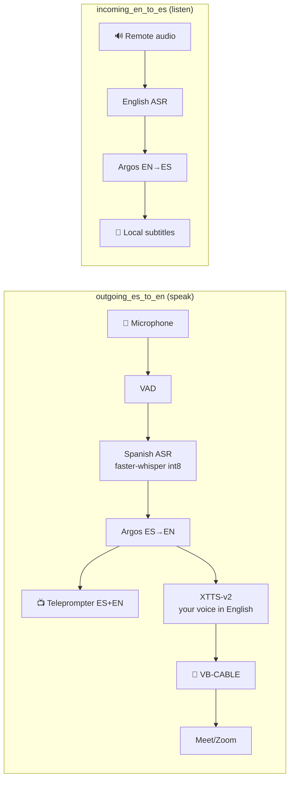

<div align="center">

# 🎙️ Real-Time Voice Translator

### ES ↔ EN for job interviews — **100% local, private, and measured on my own hardware**

> `audio → VAD → ASR → translation → TTS → audio` — the text is always on screen, so you catch a translation mistake **before** you answer.

**🌐 [English](README.md) · [Español](README.es.md)**

[](https://github.com/KevinGracianoL/traductor-voz-entrevistas/actions)


**Live demo → [traductor-demo.kevingraciano.dev](https://traductor-demo.kevingraciano.dev)** · **By [Kevin Graciano](https://github.com/KevinGracianoL)**

*A translator built for real interviews — not for demos. Every decision has its ADR, every ADR has its numbers, and the numbers were taken on the machine that will carry the interview.*

</div>

---

## 🏆 The verdict (and how it was earned)

After **three rounds of measurement on real hardware** — and after the first two metrics I defined turned out to be badly specified — the chosen engine passed the go/no-go with 100% attributed evidence:

| Gate | Measured | Limit | Verdict |
|---|---|---|---|
| **End-to-end pipeline** (audio → first audible sample on VB-CABLE, one chained run) | **worst case 1469.3 ms** (range 1237.0–1469.3, 4 runs) | < 2000 ms | ✅ **PASS** (531 ms margin) |
| TTFA first chunk (budget **derived**: 2000 − ASR − translation − routing) | 723–755 ms < 767–826 ms | derived | ✅ PASS |
| Co-resident VRAM (XTTS + Whisper) | 2906.9–2946.9 MiB | < 3276.8 | ✅ PASS |
| Total RAM (annotated context) | 13.0–13.9 GB | < 18 GB | ✅ PASS |
| Failure rate (availability) | **5% (1 of 20 runs)** — the translation stage died on an on-demand spacy download | 0% | ⚠️ Declared separately → blocking preload in the flow |
| Voice A/B (your ear + objective evidence) | timbre, 96–150 wpm pace, technical words clear | human signature | ✅ Signed |

**Why does it matter?** The 1.5–2 s ceiling of ADR-003 **was not invented or copied from a benchmark**: it was measured across the entire chain *on this 4 GB GPU*, with the ASR co-resident and the real virtual microphone. The full story of the two badly defined metrics I caught myself, fixed, and turned into rules lives in [ADR-014](docs/ADR-014-gates-aceptacion-tts.md) — five layers of evidence, none deleted.

**Streaming note (measured on the same GPU):** XTTS `inference_stream` runs at **RTF ≈ 1.8** on the GTX 1650 Ti —slower than real time— so the playback stream runs dry and the voice comes out with pauses ("one sentence fine, then word by word"). The backend synthesizes **sentence-by-sentence in batch**: `inference()` over each full sentence with the profile latents **cached** (once per profile, **747–807 ms** re-measured) and the model config's generation settings — **first chunk ~2.0 s** and **sustained RTF p95 0.85** (n=20 with the demo's co-residency: XTTS + `small` + `tiny` whispers on GPU; 0/20 runs cross 1). With the incoming whisper transcribing **in parallel** (interviewer talking over the TTS) RTF rises to ~2.8: the rest of the turn may come out with pauses — a declared limit of the 4 GB GPU that the demo does not exercise. The compute is stable; what varies is the sampled audio length. The PR #34 review caught that the first attempt called `tts.tts(speaker_wav=…)`, which **recomputes the latents on every call** (~100 ms per sentence, instrumented): the declared path keeps them. On hardware without Tensor Cores, continuous engine streaming is out of budget; on GPUs with sustained RTF < 1 it stays available under the same contract.

---

## 🎬 The demo (video)

**[`docs/demo/demo_portafolio.mp4`](docs/demo/demo_portafolio.mp4)** — a full recorded run on this machine (1 min 4 s, real system audio):

1. The **interviewer** speaks in English (arriving through VB-CABLE) and the teleprompter shows the text with its Spanish translation.
2. **You answer in Spanish** through your microphone; the answer appears on screen when the turn closes.
3. Your **cloned voice in English** comes out through the VAIO virtual microphone, **fluid** — that is the sentence-by-sentence batch described above (with `inference_stream` the buffer ran dry and it sounded choppy).

The ~14 s pause between your answer and the English voice is the declared wait, measured in the logs of this same run: 2.5 s of end-of-turn detection + a 4.2–11.5 s close (translation 0.2–0.7 s + TTS 4.2–10.7 s + routing < 0.03 s). The first chunk sounds in ~2 s with a free GPU; in the demo it shares the GPU with the flow's ASRs.

---

## 🎯 What it solves

In an English interview, a translation mistake is not a bug — **it is the wrong answer**.

This project prioritizes **verifiable text** over indistinguishable synthetic voice, and **latency measured on your hardware** over RTX 4090 benchmarks that do not hold on your laptop.

1. **Real privacy** — audio never leaves the machine. Everything runs locally (own CPU + GPU), no cloud, no APIs.
2. **Zero magic** — each stage is a pure, tested function: microphone → VAD → ASR → translation → teleprompter → voice.
3. **Evidence over opinion** — 25 ADRs, each decision with its measured why. The voice engine was rejected **twice** with numbers before being accepted with numbers.

---

## 🏗️ Architecture

Two explicit flows (ADR-015) with persistent workers, size-1 queues, cancellation, and automatic degradation without restarting the call:



**Degradation ladder (without restarting the interview):** cloned voice + subtitles → generic voice + subtitles → subtitles only. And before any defective audio reaches the virtual microphone: **ASR-loopback validation** (added/omitted/repeated words, clipping, anomalous silences) — no suspicious audio is played just to keep the clone (in non-streaming mode validation runs before routing; in streaming it protects the rest of the turn and leaves telemetry, see ADR-019).

---

## 🧪 How it was measured (what nobody copies from a README)

The engine go/no-go was not a table in a doc: it was **a self-verifying harness** (`scripts/medir_gates_tts.py`) that corrected itself five times. Each correction became a **written rule** in [ADR-014](docs/ADR-014-gates-aceptacion-tts.md), with its numbers:

1. **The gate is not declared, it is derived** — `TTFA budget = 2000 ms − (measured ASR + translation + routing)`. The literal `< 400 ms` was an invented sub-budget; today it is a computation in `gates.py` (on this machine: **767–826 ms** derived from a 1237–1469 ms pipeline), not a constant.
2. **The guard must fail on the known error** — the first guard required the *drain* to have been measured (the chunk's duration, not the latency); its test canonized the bug. The fixed guard anchors to an **independent reference** (the CABLE's physical loopback): a guard whose threshold is derived from the same definition it validates can only confirm it.
3. **A number below the device's resolution is not a fast measurement — it is a measurement that never happened.**
4. **The statistic is fixed before measuring** — and the worst case is reported when n falls short for p95.
5. **Latency is attributed 100%** — `RegistroEtapas` marks every boundary (input → ASR → translation → TTS → delivery → audible) with an exact per-iteration close; an unattributed residue triggers `raise`, not a print.

**Key instruments:** injectable clock for everything (`p95` with `n≥20`, `math.ceil`, never reporting `n<20` as p95) · first audible sample detected by **loopback** (write to CABLE Input, read CABLE Output) with a resolution guard · **windows derived from the real VAD**, never selected by their latency.

---

## ✅ Quality — 5 gates, 1 contract

| Question | Tool | Config |
|---|---|---|
| Readable and bug-free? | **ruff** | `select = ["E","F","B","SIM","UP","I","S"]` |
| Do the types fit? | **mypy --strict** | type errors = red CI |
| Does it do what it says? | **pytest** | `--cov-fail-under=90` |
| What did I not test? | **coverage** | **100%** (1259 stmts, 0 uncovered) |
| Would it catch a bug? | **mutmut** | **0 survivors** — the CI gate fails if `survived > 0` |

> `mutmut` deliberately mutates your code (flips `<=`→`<`, `*1000`→`/1000`, deletes branches…) and demands that **someone** catches it. The gate was verified by breaking the code on purpose and watching `mutmut results` reject it — and several times it found *equivalent* mutants that had to be removed by restructuring, not by pragma.
>
> **399 tests** cover the happy path **and** the failure modes: antivirus locks, truncated writes, orphan `.tmp` files, mutants contaminating each other through a leftover WAV, Windows paths with backslash/apostrophe.

---

## 🔥 What the bugs taught (and stayed as tests)

This project was developed with a strict reviewer across **many review rounds**. Every real bug left a regression test, not a patch:

- **CUDA 12/13 coexisting on one machine.** torch 2.13 ships `cudart64_13`, but `ctranslate2` needs `cublas/cudart 12` → `RuntimeError: Library cublas64_12.dll is not found`. The fix (`setup_dlls.py`) copies **exactly 3 DLLs** and registers the search dirs via `.pth` + `os.add_dll_directory`. Verified on real hardware: `docs/smoke-windows.txt`.
- **Antivirus locks on Windows.** Overwriting/deleting a freshly written `.dll` fails while the AV scans it; *renaming it does work*. `copiar_dlls` takes an immutable backup, retries with backoff, and **never leaves the venv without a DLL or with a truncated one** (3 rollback invariants).
- **100% coverage ≠ failure-mode coverage.** The r5 bug only appeared with a *dirty double* (writes garbage and then blows up); clean `raise`-and-done doubles let it pass. That double is a test today.
- **A phantom namespace package.** `makedirs` fabricated an empty `ctranslate2/` that masked a broken install. Today `dir_ct2()` derives from the real package and fails loudly.
- **A guard shielding the very bug it had to catch.** The first routing guard required the chunk's full drain to have been measured (1003.5 ms for 1 s of audio = the duration, not the latency) and its test canonized the error: 50 ms — the order of the correct value — was flagged as "broken instrument". The rule stayed written: *the guard anchors to a reference independent from the definition it validates*.
- **The statistic changed right when the numbers got worse.** p50 appeared when p95 would have been higher; from the outside it is indistinguishable from picking the statistic by its result. Today the measured worst case is reported with its declared n.
- **`ARGOS_COMPUTE_TYPE` without "default" produces garbage** in argos es→en ("mainstream" on loop), and **argos caches identical text** (0.0 ms): the harness demands correct output before measuring and measures distinct sentences, like real turns.

Each of these scenarios has its **RED → GREEN** test: the test was written, seen failing against the broken code, and then fixed.

---

## 🛠️ Stack

| Layer | Tech | Note |
|---|---|---|
| **ASR** | `faster-whisper` `int8` | TU117 without Tensor Cores → FP16 emulated, INT8 on integer cores |
| **Translation** | `argos-translate` + `ctranslate2` | Offline, CPU, free; `ARGOS_COMPUTE_TYPE=default` mandatory |
| **TTS** | **XTTS-v2** (fork `coqui-tts`) | Your voice in English, sentence-by-sentence batch (`inference` + cached latents), pre-enrolled profile |
| **Audio output** | VB-CABLE + VoiceMeeter | Two virtual pipes (interviewer / your EN voice), routed by name and env |
| **Measurement** | injectable `time.perf_counter` + `RegistroEtapas` | 100% attribution, honest p95 (n≥20) |
| **UI** | `FastAPI` + ES+EN teleprompter | `localhost:8000`, Caddy deploy |
| **Quality** | `ruff` · `mypy --strict` · `pytest` · `mutmut` | 5 gates, CI on GitHub Actions |

**Declared licenses (one by one):** code MIT · XTTS-v2 weights **Coqui Public Model License** (personal non-commercial use — the project declares the restriction, it does not silence it) · OpenVoice V2 MIT · Supertonic 3 OpenRAIL-M. *CosyVoice 3 (Apache-2.0) is noted as a future candidate to lift the non-commercial ceiling.*

---

## 💻 Requirements

- **Reference hardware:** Ryzen 5 4600H / GTX 1650 Ti 4 GB (TU117) / 24 GB RAM — 0 ms of network
- Python 3.11+, CUDA 13.2, Windows 10/11, a microphone, [VB-CABLE](https://vb-audio.com/Cable/) and [VoiceMeeter](https://vb-audio.com/Voicemeeter/) (free drivers) — a single cable works, two pipes avoid feedback between the flows

---

## 🚀 Installation

```powershell
# 1. Environment
python -m venv venv; .\venv\Scripts\Activate.ps1

# 2. Deps (PyTorch with CUDA)
pip install -r requirements.txt --extra-index-url https://download.pytorch.org/whl/cu132
python setup_dlls.py

# 3. Verify local == CI
ruff check .; ruff format --check .; mypy .; pytest
```

## ▶️ Usage

```powershell
$env:PYTHONPATH = "src"
python scripts/verificar_hardware.py  # → CUDA: True | GTX 1650 Ti | VRAM 3.2/4 GB | mic → text
python scripts/demo_traduccion.py     # → "Tell me about a hard bug..." ↔ "Háblame de un bug..."
```

**Re-measure the engine go/no-go on your hardware** (the ADR-014 harness, self-verification included):

```powershell
$env:PYTHONPATH = "src"
python scripts/medir_gates_tts.py --motor xtts --warmup-audio tu_voz.wav --referencia tu_voz.wav
```

---

## 🔊 Two audio pipes: VB-CABLE + VoiceMeeter (zero cost)

With a single virtual cable, your English voice (TTS) and the interviewer's voice enter the
same pipe: the incoming flow would hear **your own TTS** and transcribe it as if it were the
interviewer ( physical feedback of the pipe, not a software bug). The fix is to separate the
pipes — free, with [VoiceMeeter](https://vb-audio.com/Voicemeeter/) (same vendor as VB-CABLE,
donationware with no minimum):

| Pipe | Device | Carries |
|---|---|---|
| **VB-CABLE** (the one you already have) | `CABLE Input` → `CABLE Output` | The **interviewer's** voice (simulator, or Meet/Zoom with audio output to the cable) |
| **VoiceMeeter** (install + reboot) | `VoiceMeeter Input` (VAIO) → `VoiceMeeter Out` | **Your English voice** (TTS) — it is the virtual microphone Meet/OBS see |

There is no need to open the VoiceMeeter console: the VAIO pair works as a pass-through cable.
You hear the interviewer through the `CABLE Output` monitor (Windows: device properties →
"Listen to this device").

Devices are configurable via env (backwards-compatible defaults with a single cable):

```powershell
# Where the incoming flow READS from (the interviewer arrives through the clean VB-CABLE):
$env:TRADUCTOR_DEVICE_INCOMING = "CABLE Output"       # default
# Where the outgoing TTS WRITES to (virtual mic for Meet/OBS):
$env:TRADUCTOR_DEVICE_OUTGOING = "VoiceMeeter Input"  # default: "CABLE Input"
# Outgoing microphone (pyaudio index; the demo uses the laptop's via MME):
$env:TRADUCTOR_MIC_INDEX = "1"
```

**Running the flows (the video demo):**

```powershell
$env:PYTHONPATH = "src"
# 0. The interviewer WAV is gitignored (*.wav never enters the repo):
#    regenerate it with the venv-tts python (coqui):
venv-tts\Scripts\python.exe scripts/audio/generar_entrevistador.py
# 1. Teleprompter (ES+EN subtitles, with each voice's source): http://localhost:8000
python -m uvicorn traductor.ui.app:app --host 127.0.0.1 --port 8000
# 2. Incoming: interviewer → Spanish subtitles (reads from TRADUCTOR_DEVICE_INCOMING)
python scripts/flujo_incoming.py
# 3. Outgoing: your ES voice → English into the virtual mic (writes to TRADUCTOR_DEVICE_OUTGOING)
python scripts/flujo_outgoing.py
# 4. Interviewer simulator (one pass; writes to the VB-CABLE)
python scripts/reproducir_entrevistador.py --veces 1 --delay 2
```

Turn adjustments via env (no code changes): `TRADUCTOR_SILENCIO_TURNO_S` (1.5 s of
silence closes your turn → the whole paragraph is ONE turn, no chopping),
`TRADUCTOR_FRAGMENTO_MAX_S` (4 s max per incoming fragment → whisper `small`
does not hallucinate; moving from `tiny` to `small` cost ~550–860 ms measured per 3 s
fragment, and cut the corpus hallucinations) and `TRADUCTOR_UMBRAL_RMS` (300,
voice activity on the cable).

Other env settings (validated at startup: a typo fails with a project message, not
inside CTranslate2 mid-recording):
`TRADUCTOR_MODELO_ASR` (default `small` for the outgoing Spanish voice; `tiny`
confused "un bug" with "a walk") and `TRADUCTOR_ASR_DEVICE` (`cuda` or `cpu`): on
4 GB GPUs **`cpu`** for the outgoing ASR leaves the GPU to the TTS and
the incoming whisper (VRAM margin: 3.3/4.0 GiB with three co-resident models). On
CPU, measured per 3 s fragment of real Spanish speech: `small`
**1.9 s** (RTF 0.63) and `base` **0.7 s** (RTF 0.23). With a laptop microphone, the
recommended `TRADUCTOR_SILENCIO_TURNO_S` goes up to **2.5 s** (natural pauses
between sentences of a paragraph must not close the turn).

**Technical note — why MME and not WASAPI (bug caught with a pure 440 Hz tone):**
the VB-Audio engine runs internally at **44100**. The same device exposed by
WASAPI at 48000 goes through a resampler that on Windows inserts **phase jumps every
~20 ms**: audio with clicks inaudible to the ear but that break transcription
(whisper heard "hard bug you solved" as different words). The code **prefers
MME devices** (native 44100 rate) automatically: the test tone comes out at
**440.0 Hz exact on MME** and 522 Hz with jumps on WASAPI. If you pick devices by
hand, use the MME ones.

---

## 📁 Structure

```
├── src/traductor/
│   ├── hardware/cuda.py        # verifies GPU/VRAM
│   ├── audio/captura.py        # mic → text (RealtimeSTT)
│   ├── audio/virtual.py        # deterministic routing by name (VB-CABLE)
│   ├── traduccion/argos.py     # EN↔ES offline (ARGOS_COMPUTE_TYPE pinned)
│   ├── asr/                    # bidirectional ASR benchmark (ADR-012)
│   │   └── ...                 # pure WER, manifest, measurement, aggregation
│   ├── tts/                    # neutral contracts + chosen engine (ADR-011/014)
│   │   ├── modelos.py          # VoiceProfile, AudioResult, Salud
│   │   ├── backend.py          # TTSBackend (Protocol)
│   │   ├── tienda_json.py      # real store: one JSON per profile (ADR-013)
│   │   ├── enrolamiento.py     # samples → validated VoiceProfile (ADR-013)
│   │   ├── worker.py           # isolated worker: JSON-line jobs (ADR-013)
│   │   ├── gates.py            # go/no-go: DERIVED TTFA budget (ADR-014)
│   │   ├── backend_xtts.py     # XTTS-v2 via coqui-tts fork (chosen engine)
│   │   ├── backend_b.py        # candidate B (Supertonic+OpenVoice): rejected, evidence kept
│   │   └── harness.py          # parser + RegistroEtapas + instrument guards
│   ├── flujo/                  # pure core + hardware adapters (ADR-015)
│   │   ├── outgoing.py         # ES→EN: ladder, artifacts, close on first chunk
│   │   ├── incoming.py         # EN→ES: real-time subtitles
│   │   └── adaptadores.py      # microphone, TTS worker, cable, teleprompter
│   ├── ui/                     # FastAPI teleprompter + WebSocket (ADR-007)
│   └── latencia/
│       ├── presupuesto.py      # does it fit? who is slower?
│       └── medidor.py          # injectable clock, honest p50/p95 (n≥20)
├── scripts/                    # hardware, translation, gates harness
├── setup_dlls.py               # CUDA 12/13 coexisting (Windows, AV locks)
├── docs/                       # 25 ADRs with measured evidence + demo/ (video)
├── tests/                      # 399 tests, 100% cov, mutants in CI
└── .github/workflows/ci.yml    # 5 gates that fail the PR if anything breaks
```

---

## 📋 ADRs — decisions with evidence

| # | Decision | Why |
|---|---|---|
| 001 | **Cascade, not end-to-end** | [ADR-001](docs/ADR-001-cascada-no-end-to-end.md): verifiable text > minimum latency |
| 002 | **Virtual audio at OS level** | [ADR-002](docs/ADR-002-audio-virtual-nivel-so.md): works with any Meet/Zoom, no API per platform |
| 003 | **1.5–2 s ceiling** | [ADR-003](docs/ADR-003-techo-presupuesto-latencia.md): cut quality, never latency; derived TTFA budget |
| 004 | **INT8, not FP16** | [ADR-004](docs/ADR-004-int8-no-fp16.md): TU117 without Tensor Cores, FP16 emulated |
| 005 | **Local, not remote** | [ADR-005](docs/ADR-005-local-no-remoto.md): AVX2+CUDA+0 ms beats geography |
| 006 | **On top of RealtimeSTT** | [ADR-006](docs/ADR-006-sobre-realtimestt.md): VAD/ASR is commodity, we orchestrate |
| 007 | **Teleprompter first** | [ADR-007](docs/ADR-007-teleprompter-primero.md): weeks vs months, honesty in the interview |
| 008 | **Automatic fallback** | [ADR-008](docs/ADR-008-fallback-automatico.md): an interview is not a log |
| 009 | **Direction by source** | [ADR-009](docs/ADR-009-direccion-por-fuente.md): deterministic, 0 ms, no code-switching detector to fail |
| 010 | **Chatterbox rejected as TTS** | [ADR-010](docs/ADR-010-chatterbox-rechazado.md): 17.4 s warm / 3.6 GB **measured** on this GPU, without Whisper co-residency |
| 011 | **Chosen engine: XTTS-v2** | [ADR-011](docs/ADR-011-contratos-neutrales-tts.md): accepted by the measured gates; CPML declared (personal use); Supertonic+OpenVoice as B (rejected); Pocket discarded |
| 012 | **Bidirectional ASR benchmark** | [ADR-012](docs/ADR-012-benchmark-asr.md): Moonshine Small CPU vs faster-whisper Small GPU; normalized WER + p50/p95 |
| 013 | **Isolated TTS worker + enrollment** | [ADR-013](docs/ADR-013-worker-tts-enrolamiento.md): JSON-line jobs, input boundary, local store |
| 014 | **Engine acceptance gates** | [ADR-014](docs/ADR-014-gates-aceptacion-tts.md): **five layers of instrument correction** + derived TTFA budget; end-to-end pipeline 1469.3 ms (worst case) < 2000 ms |
| 015 | **Flow architecture and ladder** | [ADR-015](docs/ADR-015-arquitectura-flujos-escalera.md): outgoing/incoming, size-1 queues, artifact validation, 4 levels |
| 019 | **Session and endurance gates** | [ADR-019](docs/ADR-019-endurance-sesion.md): 90 continuous minutes, no OOM, stable memory, artifacts, user-signed A/B — the final approval |

> The numbering is not contiguous: **016–018 remain unused reserve numbers** (no document or reference anywhere in the repo's history); the real ADRs are **001–015 + 019**. The 001–009 documents were reconstructed on 2026-09-18 from the original commits, code, and tests (the early era did not write the files).

---

## 🗺️ Roadmap

- [x] **Steps 1–5** — hardware, translation, measurement, virtual audio, teleprompter
- [x] **Phases 2a–2e** — CUDA DLLs, TTS contracts, ASR benchmark, worker + enrollment, gates
- [x] **Phase 2f — Engine go/no-go** — **XTTS-v2 accepted by the measured gates** (pipeline worst case 1469.3 ms < 2000 ms, 531 ms margin; candidate B rejected for architectural TTFA 7885.8 ms) — evidence in [ADR-014](docs/ADR-014-gates-aceptacion-tts.md)
- [x] **Phase 2g — Chosen engine** — XTTS-v2; final approval backed by [ADR-019](docs/ADR-019-endurance-sesion.md)
- [x] **Phase 3 — The `outgoing_es_to_en` flow** — mic → VAD → ASR es → Argos → teleprompter → XTTS → VB-CABLE, with the degradation ladder (ADR-015)
- [x] **Phase 4 — 90 min endurance + turn-close fixes** — the long ADR-019 run (417 turns, stable memory) + worker streaming job, block-wise cable and live artifact validation: re-run of 90 min with **692 turns**, turn close p95 **21.3 s → 1.60 s**, late answers 417/417 → **1/692**
- [x] **Phase 5 — The `incoming_en_to_es` flow** — the interviewer's audio (Meet/Zoom through the virtual cable) → ASR en → Argos EN→ES → **Spanish subtitles** on the teleprompter (ADR-015)
- [ ] **Optional remote clone (extension)** — dynamic clone of the interviewer's voice: subtitles first; the clone only if the collected samples pass the ADR-015 controls

---

<div align="center">

**Made by [Kevin Graciano](https://github.com/KevinGracianoL)** — learning in public, measuring on my own hardware.

*Privacy by design: zero real interview audios and zero credentials in the repo's history.*

</div>
